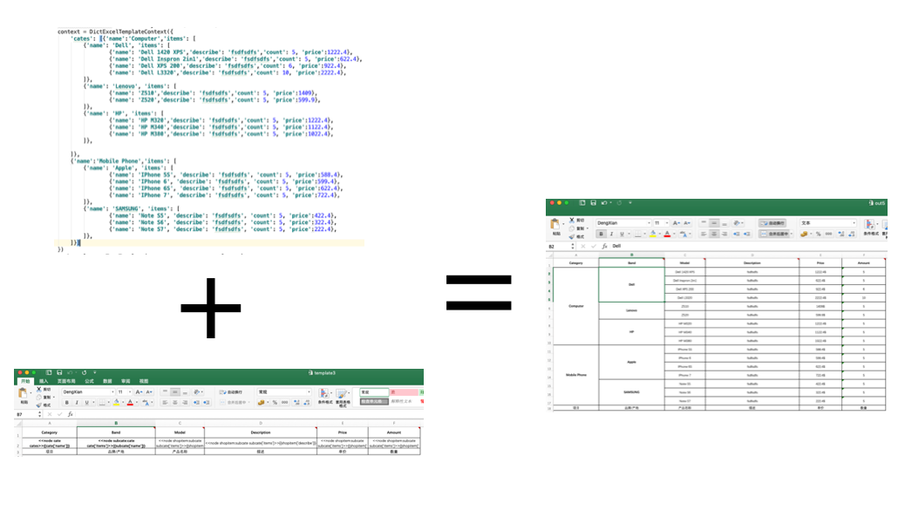

# Excel Template

# 1. 项目简介

本项目开发的目的，是为了完成一个方便可用的python中间件，用于快速生成excel文件。
项目分为 excel的操作（ExcelProcessor)、上下文（ExcelTemplateContext)、表达式计算和模板生成这四个部分。
目前实现了对openpyxl类库的支持，未来会对接更多的excel操作类库。




# 2. 使用方法

## 2.1 列表绑定

可以按照testcase4中的代码这样，准备一个上下文dict，然后设置一个key='students'
students里面是一个对象数组，每个元素表示一个学生的信息。

```python
        processor = OpenpyXlExcelProcessor('xlstemplates/template4.xlsx', 'Sheet1')
        evaluator = PyEvaluator()
        embeddedEvaluator = EmbeddedPyEvaluator(evaluator)
        context = DictExcelTemplateContext({
            "students":[
                {'name':'s1', 'age':12, 'class':'2-A' ,'grade':'A-'},
                {'name':'s2', 'age':13, 'class':'2-B' ,'grade':'B-'},
                {'name':'s3', 'age':14, 'class':'2-C' ,'grade':'C-'},
                {'name':'s4', 'age':15, 'class':'2-D' ,'grade':'E-'},
                {'name':'s5', 'age':16, 'class':'2-E' ,'grade':'F-'},
                {'name':'s6', 'age':17, 'class':'2-F' ,'grade':'A+'},
            ]
        })
        archtemplate = TreeTemplate(processor, context, evaluator)
        rptemplate = ExcelRelpaceTemplate(processor, context, embeddedEvaluator)
        archtemplate.process()
        rptemplate.process()
        processor.save('out6.xlsx')
```


## 2.2 树绑定
```python
from wysiwygtemplate.treetemplate import *
from wysiwygtemplate.openpyprocessor import *
from wysiwygtemplate.pyevaluator import *

# 声明一个processor 用于处理excel
processor = OpenpyXlExcelProcessor('xlstemplates/template3.xlsx', 'Sheet1')
# 声明一个表达式Evaluator 用于解析表达式
evaluator = PyEvaluator()
# 声明一个可嵌入文本的Evaluator 用于解析文本与表达式的混合文本
embeddedEvaluator = EmbeddedPyEvaluator(evaluator)
# 将数据填充到上下文
context = DictExcelTemplateContext({
    'cates': [{'name':'Computer','items': [
        xxxx
    ]},
    {'name':'Mobile Phone','items': [
        xxxx
    ]}]
})
# 声明一个树模板
treetemplate = TreeTemplate(processor, context, evaluator)
# 声明一个文本替换模板
rptemplate = ExcelRelpaceTemplate(processor, context, embeddedEvaluator)
# 先执行树模板，进行行和列的扩展，并设置单元格上下文
treetemplate.process()
# 然后进行文本替换
rptemplate.process()
# 保存输出文件
processor.save('out5.xlsx')
```
